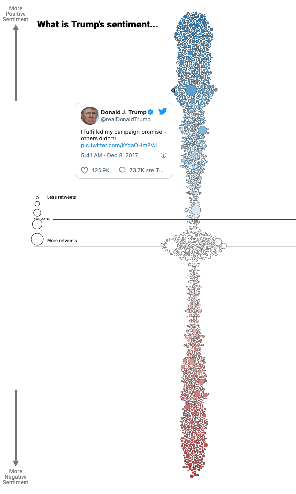
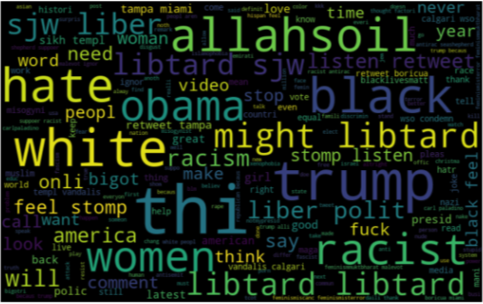
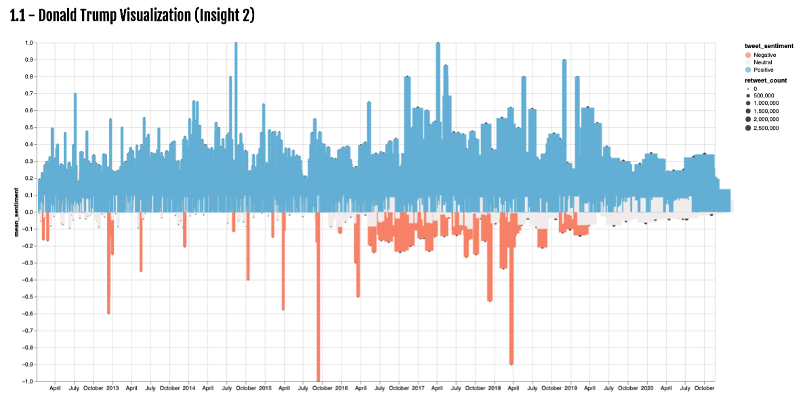
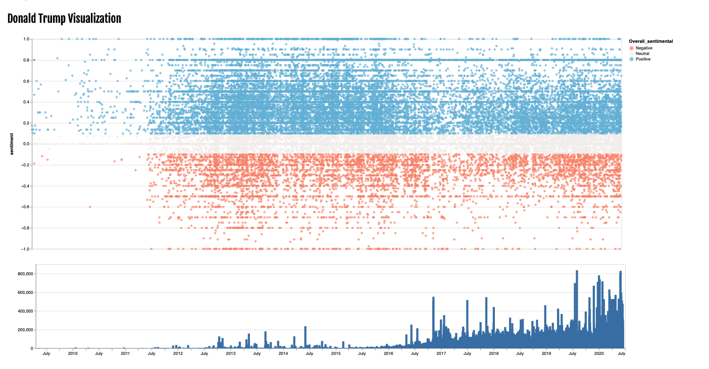

@import "../../css/datavis.less"

```elm {l=hidden}
import Tidy exposing (..)
import VegaLite exposing (..)
```

# Other designs

{(whoami|}
Richard Guaman - richard.guaman-sangucho@city.ac.uk
{|whoami)}

{(task|}

If you have a specific design in mind but cannot implement all of it, you may supplement your implementation with images/mockups demonstrating clearly your intended design.

{|task)}

## Design 1 - Inspiration

I based my main design on the image below. [Reference](https://www.dremio.com/trump-twitter-sentiment-analysis/)



## Design 2 - CloudWord

I wanted create similar design with the most used words by Donal Trump and compare it with Joe Biden, unfortunately I was not able to do so using ELM.



## Examples bad of designs 1



## Examples bad of design2


