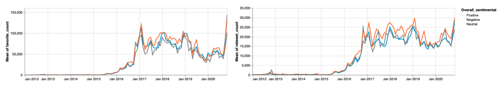
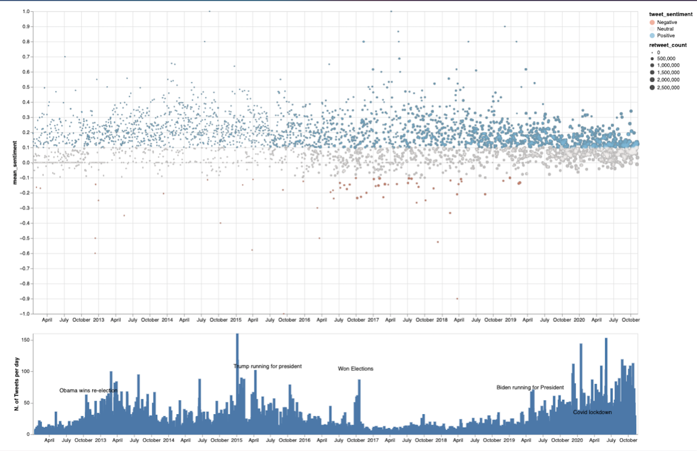
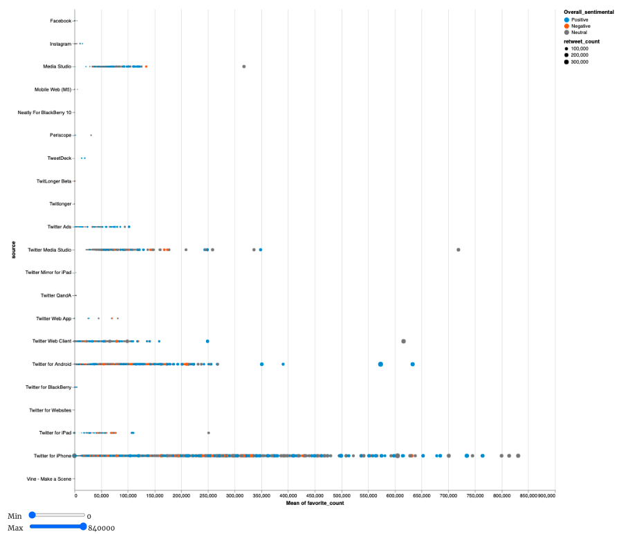

@import "../../css/datavis.less"

```elm {l=hidden}
import Tidy exposing (..)
import VegaLite exposing (..)
```

# Data Visualization Project Summary

{(whoami|} {|whoami)}

{(task|}

You should complete this datavis project summary document and submit it, along with any necessary supplementary files to Moodle by **Sunday 20th December, 5pm GMT**. Submissions will be awarded up to **80 marks** towards your coursework assessment total.

You are also encouraged to regularly commit and push changes to your datavis project throughout the term as you develop your project.

Dataset sources:
https://www.kaggle.com/austinreese/trump-tweets?select=realdonaldtrump.csv
https://www.kaggle.com/rohanrao/joe-biden-tweets
Note\* I have used other tools(python) to extract extra data (Sentiment, OverallSentiment) from these dataset.

{|task)}

{(questions|}

- Using sentimental analysis on the tweets of Donald Trump/Joe Biden, can we spot any trend?
- Can we see any trend based on the number of times that they tweets? (Eg. Daily, Monthly)
- How do people engage with Donald Trump/Joe Biden tweets (like/retweet)? Are there any trends?
- How did the Donald Trump administration affect the stock market since he was elected?
- What are the worst tweets posted by these presidents? Any correlation?
- Are presidents more likely to tweet good things as elections approach?
- Donald Trump is not the only one who tweets from his account, does the source of each tweet matters(Android, iPhone, iPad, etc) matter? can we spot any trend?
- etc.

{|questions)}

{(visualization|}

## 1.1 - Donald Trump average Tweet - Visualization (Insight 2)

The following visualization allows us to see different types of information in one chart.
First, We have a timeline on the X-Axis where each dot represent the average sentiment of that day. Second - Hovering a single point we can see each tweet's statistics.
On the bottom chart, we can see the number of tweets that Donald Trump has tweeted on a single day as well as some major evens that occurred from 2012 to 2020.

```elm {v interactive }
donald_trump : Spec
donald_trump =
    let
        data =
            dataFromUrl "https://richard-gm.github.io/webServerDataViz/DonaldTrump_Daily_Updated.csv"

        barSel =
            selection
                << select "myBrush" seInterval [ seEmpty, seEncodings [ chX ] ]

        scatterSel =
            selection
                << select "myBrush" seInterval []

        trans =
            transform
                << filter (fiSelection "myBrush")

        encBars =
            encoding
                << position X [ pName "date_only_x", pTemporal, pAxis [ axGrid False, axTitle "" ] ]
                << position Y [ pName "countOf_tweets_day", pQuant, pAxis [ axGrid False, axTitle "N. of Tweets per day" ] ]

        -- Annotation layer
        annotationData =
            dataFromRows []
                << dataRow
                    [ ( "date_only_x", str "2012-10-29" )
                    , ( "annotation", str "Obama wins re-election " )
                    , ( "countOf_tweets_day", num 65 )
                    ]
                << dataRow
                    [ ( "date_only_x", str "2015-06-16" )
                    , ( "annotation", str "Trump running for president" )
                    , ( "countOf_tweets_day", num 103 )
                    ]
                << dataRow
                    [ ( "date_only_x", str "2016-10-01" )
                    , ( "annotation", str "Won Elections" )
                    , ( "countOf_tweets_day", num 100 )
                    ]
                << dataRow
                    [ ( "date_only_x", str "2019-04-25" )
                    , ( "annotation", str "Biden running for President" )
                    , ( "countOf_tweets_day", num 70 )
                    ]
                << dataRow
                    [ ( "date_only_x", str "2020-03-24" )
                    , ( "annotation", str "Covid lockdown" )
                    , ( "countOf_tweets_day", num 30 )
                    ]

        encAnnotation =
            encoding
                << position X [ pName "date_only_x", pTemporal ]
                << position Y [ pName "countOf_tweets_day", pQuant ]
                << text [ tName "annotation" ]

        specAnnotation =
            asSpec [ annotationData [], encAnnotation [], textMark [ maDy -5 ] ]

        cfg =
            configure
                << configuration (coView [ vicoStroke Nothing ])

        specAllBars =
            asSpec [ width 1200, barSel [], encBars [], bar [] ]

        specFilteredBars =
            asSpec [ width 1200, trans [], encBars [], bar [ maColor "goldenrod" ] ]

        specBars =
            asSpec [ width 1200, layer [ specAllBars, specFilteredBars, specAnnotation ] ]

        encScatter =
            encoding
                << position X [ pName "date_only_x", pTemporal, pAxis [ axTitle "" ] ]
                << position Y [ pName "mean_sentiment", pQuant, pScale [ scDomain (doNums [ -1, 1 ]) ] ]
                << color
                    [ mName "tweet_sentiment"
                    , mScale
                        [ scScheme "redblue" []
                        , scDomain (doMid 0)
                        ]
                    ]
                << tooltips
                    [ [ tName "countOf_tweets_day" ]
                    , [ tName "favorite_count" ]
                    , [ tName "retweet_count" ]
                    , [ tName "tweet_sentiment" ]
                    , [ tName "date_only_y" ]
                    , [ tName "mean_sentiment", tQuant ]
                    ]
                << size
                    [ mName "retweet_count"
                    , mScale
                        [ scRange (raNums [ 5, 100 ])
                        , scType scPow -- Area proportional to datum raised to power of some exponent
                        , scExponent 0.7 -- Default value (i.e. area directly proportional to datum)
                        ]
                    ]

        specAllScatter =
            asSpec [ scatterSel [], encScatter [], circle [ maTooltip ttEncoding ] ]

        specFilteredScatter =
            asSpec [ trans [], encScatter [], circle [ maSize 20, maFill "black" ] ]

        specScatter =
            asSpec [ width 1200, height 600, layer [ specFilteredScatter, specAllScatter ] ]
    in
    toVegaLite [ data [], vConcat [ specScatter, specBars ] ]
```

```elm {l=hidden}
fmColours =
    categoricalDomainMap
        [ ( "Positive", "rgb(8,146,208)" )
        , ( "Negative", "rgb(247,109,47)" )
        , ( "Neutral", "Grey" )
        ]
```

### 1.1.1 - How people reacts to Donald Trump tweets on Average

We can see that people are more likely to engage (like/retweet) more with negative tweets.
Refer to scatterPlot_DonaldTrump.md to get the full analysis.

```elm {v interactive}
peopleReactingToDonalTrumpTweets : Spec
peopleReactingToDonalTrumpTweets =
    let
        data =
            dataFromUrl "https://richard-gm.github.io/webServerDataViz/DonaldTrump_upToDate.csv"

        sel =
            selection
                << select "mySelection" seInterval [ seBindScales ]

        enc1 =
            encoding
                << position X [ pName "date_only", pTimeUnit yearMonth, pTitle "" ]
                << position Y [ pRepeat arColumn, pAggregate opMean ]
                << detail [ dName "date_only", dTimeUnit yearMonth ]
                << color [ mName "Overall_sentimental" ]

        spec1 =
            asSpec [ enc1 [], line [ maOpacity 0.2 ] ]

        enc2 =
            encoding
                << position X [ pName "date_only", pTimeUnit yearMonth ]
                << position Y [ pRepeat arColumn, pAggregate opMean ]
                << color [ mName "Overall_sentimental", mScale fmColours ]

        spec2 =
            asSpec [ sel [], enc2 [], line [] ]
    in
    toVegaLite
        [ data []
        , columns 2
        , repeat [ columnFields [ "favorite_count", "retweet_count" ] ]
        , specification (asSpec [ width 600, layer [ spec1, spec2 ] ])
        , sel []
        ]
```

### 1.1.2 Stock market (S&P500) - Events during Trump Administration

Financial markets are not receptive to surprises and uncertainty. Twitter has the capability to supply both. By looking at **1.1.2 Stock market (S&P500) - Events during Trump Administration**
one can see that the stock market has been very volatile since Donal Trump was elected.

Concerns over a potential U.S./China trade war were reinforced on 2 March 2018 when President Trump tweeted:

"When a country (USA) is losing many billions of dollars on trade with virtually every country it does business with, trade wars are good, and easy to win.
For example, when we are down \$100 billion with a certain country and they get cute, don't trade anymore-we win big. It's easy!" [Tweet - Link](https://twitter.com/realDonaldTrump/status/969525362580484098?s=20)

This created an instant sell-off for the following months and on December 4, 2018,
the Dow Jones Industrial Average logged its worst day in nearly a month declined nearly 600 points, as a result, Trump’s Trade War Cost U.S. Company Stock Prices \$1.7 Trillion. [Reference](https://www.forbes.com/sites/stuartanderson/2020/06/01/trumps-trade-war-cost-us-company-stock-prices-17-trillion/?sh=1416043a5279)

```elm {v interactive }
stockMarket : Spec
stockMarket =
    let
        sel =
            selection
                << select "mySelection" seInterval [ seBindScales ]

        data =
            dataFromUrl "https://richard-gm.github.io/webServerDataViz/stock.csv"

        highlightData =
            dataFromColumns []
                << dataColumn "start" (strs [ "2016-October", "2017-January", "2018-February", "2018-October", "2020-February" ])
                << dataColumn "end" (strs [ "2016-November", "2017-February", "2018-April", "2018-November", "2020-May" ])
                << dataColumn "event" (strs [ "1 - Donal Trump elected president", "2 - Corporate Tax cut hailed", "3 - US/China Tariffs trade war", "4 - Interest rate hikes by the Fed", "5 - Fear of Covid-19 started" ])

        encRects =
            encoding
                << position X [ pName "start", pTemporal ]
                << position X2 [ pName "end", pTemporal ]
                << color [ mName "event" ]

        specRects =
            asSpec [ highlightData [], encRects [], rect [ maOpacity 0.4 ] ]

        enc =
            encoding
                << position X [ pName "Date", pTemporal, pAxis [ axGrid False, axTitle "S&P 500 Stock market" ] ]

        encRule =
            encoding
                << position Y [ pName "Low", pQuant, pScale [ scZero False ] ]
                << position Y2 [ pName "High" ]

        specRule =
            asSpec [ encRule [], rule [] ]

        encBar =
            encoding
                << position Y [ pName "Open", pQuant ]
                << position Y2 [ pName "Close" ]

        specBar =
            asSpec [ encBar [], line [] ]
    in
    toVegaLite [ width 1200, height 200, enc [], data [], layer [ specRects, specRule, specBar ] ]
```

## 2.1 Joe Biden Visualization(Insight 2)

The following visualization allows us to see different types of information in one chart. First, We have a timeline on the X-Axis where each dot represent the average sentiment of that day. Second - Hovering a single point we can see each tweet's statistics.
On the bottom chart, we can see the number of tweets that Donald Trump has tweeted on a single day as well as some major evens that occurred from 2012 to 2020.

```elm {v interactive }
joe_biden : Spec
joe_biden =
    let
        data =
            dataFromUrl "https://richard-gm.github.io/webServerDataViz/JoeBiden_Daily_summary.csv"

        barSel =
            selection
                << select "myBrush" seInterval [ seEmpty, seEncodings [ chX ] ]

        scatterSel =
            selection
                << select "myBrush" seInterval []

        trans =
            transform
                << filter (fiSelection "myBrush")

        encBars =
            encoding
                << position X [ pName "date_only_x", pTemporal, pAxis [ axGrid False, axTitle "" ] ]
                << position Y [ pName "countOf_tweets_day", pQuant, pAxis [ axGrid False, axTitle "N. of Tweets per day" ] ]

        -- Annotation layer
        annotationData =
            dataFromRows []
                << dataRow
                    [ ( "date_only_x", str "2012-10-29" )
                    , ( "annotation", str "Obama wins re-election " )
                    , ( "countOf_tweets_day", num 29 )
                    ]
                << dataRow
                    [ ( "date_only_x", str "2016-10-01" )
                    , ( "annotation", str "Tweets about new President" )
                    , ( "countOf_tweets_day", num 20 )
                    ]
                << dataRow
                    [ ( "date_only_x", str "2019-04-25" )
                    , ( "annotation", str "Biden campaign for President" )
                    , ( "countOf_tweets_day", num 20 )
                    ]
                << dataRow
                    [ ( "date_only_x", str "2020-03-24" )
                    , ( "annotation", str "Covid lockdown" )
                    , ( "countOf_tweets_day", num 30 )
                    ]
                << dataRow
                    [ ( "date_only_x", str "2020-10-01" )
                    , ( "annotation", str "Won Elections" )
                    , ( "countOf_tweets_day", num 41 )
                    ]

        encAnnotation =
            encoding
                << position X [ pName "date_only_x", pTemporal ]
                << position Y [ pName "countOf_tweets_day", pQuant ]
                << text [ tName "annotation" ]

        specAnnotation =
            asSpec [ annotationData [], encAnnotation [], textMark [ maDy -5 ] ]

        cfg =
            configure
                << configuration (coView [ vicoStroke Nothing ])

        specAllBars =
            asSpec [ width 1200, barSel [], encBars [], bar [] ]

        specFilteredBars =
            asSpec [ width 1200, trans [], encBars [], bar [ maColor "goldenrod" ] ]

        specBars =
            asSpec [ width 1200, layer [ specAllBars, specFilteredBars, specAnnotation ] ]

        encScatter =
            encoding
                << position X [ pName "date_only_x", pTemporal, pAxis [ axTitle "" ] ]
                << position Y [ pName "mean_sentiment", pQuant, pScale [ scDomain (doNums [ -1, 1 ]) ] ]
                << color
                    [ mName "tweet_sentiment"
                    , mScale
                        [ scScheme "redblue" []
                        , scDomain (doMid 0)
                        ]
                    ]
                << tooltips
                    [ [ tName "countOf_tweets_day" ]
                    , [ tName "likes" ]
                    , [ tName "retweets" ]
                    , [ tName "tweet_sentiment" ]
                    , [ tName "date_only_y" ]
                    , [ tName "mean_sentiment", tQuant ]
                    ]
                << size
                    [ mName "retweets"
                    , mScale
                        [ scRange (raNums [ 5, 100 ])
                        , scType scPow -- Area proportional to datum raised to power of some exponent
                        , scExponent 0.7 -- Default value (i.e. area directly proportional to datum)
                        ]
                    ]

        specAllScatter =
            asSpec [ scatterSel [], encScatter [], circle [ maTooltip ttEncoding ] ]

        specFilteredScatter =
            asSpec [ trans [], encScatter [], circle [ maSize 25, maFill "black" ] ]

        specScatter =
            asSpec [ cfg [], width 1200, height 600, layer [ specFilteredScatter, specAllScatter ] ]
    in
    toVegaLite [ data [], vConcat [ specScatter, specBars ] ]
```

#### 2.1.1 How people reacts to Joe Biden tweets on average

We can see that people are more likely to engage (like/retweet) more with negative tweets
Refer to **scatterPlot_JoeBiden.md** to get the full analysis.

```elm {v interactive}
peopleReactingToJoeBidenTweets : Spec
peopleReactingToJoeBidenTweets =
    let
        data =
            dataFromUrl "https://richard-gm.github.io/webServerDataViz/JoeBiden_sentimental_tweets.csv"

        sel =
            selection
                << select "mySelection" seInterval [ seBindScales ]

        enc1 =
            encoding
                << position X [ pName "date_only", pTimeUnit yearMonth, pTitle "" ]
                << position Y [ pRepeat arColumn, pAggregate opMean ]
                << detail [ dName "date_only", dTimeUnit yearMonth ]
                << color [ mName "Overall_sentimental" ]

        spec1 =
            asSpec [ enc1 [], line [ maOpacity 0.2 ] ]

        enc2 =
            encoding
                << position X [ pName "date_only", pOrdinal, pTimeUnit yearMonth ]
                << position Y [ pRepeat arColumn, pAggregate opMean ]
                << color [ mName "Overall_sentimental", mScale fmColours ]

        spec2 =
            asSpec [ sel [], enc2 [], line [] ]
    in
    toVegaLite
        [ data []
        , columns 2
        , repeat [ columnFields [ "likes", "retweets" ] ]
        , specification (asSpec [ width 600, layer [ spec1, spec2 ] ])
        , sel []
        ]
```

## 3 All in one visualizations

The following visualization allows us to see different types of information in one chart. First, We have a timeline where each tweet is represented by a dot. Second - Hovering a single point we can see each tweet's statistics as well as the actual tweet(text).
Third, The sizes of the tweets are represented by the number of time that it has been retweeted.

#### 3.1 Joe Biden - List of all tweets(2012 to 2020)

The size of each point(tweet) represents the number of times that it has been retweeted.
You can also hover each point to see specific data about that tweet.

```elm {v interactive }
joe_biden_all_on_one : Spec
joe_biden_all_on_one =
    let
        data =
            dataFromUrl "https://richard-gm.github.io/webServerDataViz/JoeBiden_sentimental_tweets.csv"

        sel =
            selection
                << select "maxSlider"
                    seSingle
                    [ seInit [ ( "maxReported", num 1 ) ]
                    , seBind [ iRange "maxReported" [ inName "Max", inMin 0, inMax 1 ] ]
                    ]
                << select "minSlider"
                    seSingle
                    [ seInit [ ( "minReported", num -1 ) ]
                    , seBind [ iRange "minReported" [ inName "Min", inMin -1, inMax 0 ] ]
                    ]

        trans =
            transform
                << filter (fiExpr "datum.sentiment >= minSlider_minReported && maxSlider_maxReported >= datum.sentiment")

        enc =
            encoding
                << position X [ pName "date_only", pOrdinal, pTemporal, pAxis [ axTitle "" ] ]
                << position Y [ pName "sentiment", pQuant ]
                << color
                    [ mName "Overall_sentimental"
                    , mScale fmColours
                    ]
                << tooltips
                    [ [ tName "date_only", tTemporal ]
                    , [ tName "tidy_tweets" ]
                    , [ tName "Overall_sentimental" ]
                    , [ tName "likes" ]
                    , [ tName "retweets", tQuant ]
                    ]
                << size
                    [ mName "likes"
                    , mScale
                        [ scRange (raNums [ 5, 100 ])
                        , scType scPow -- Area proportional to datum raised to power of some exponent
                        , scExponent 0.7 -- Default value (i.e. area directly proportional to datum)
                        ]
                    ]
    in
    toVegaLite [ width 1200, height 500, trans [], sel [], data [], circle [ maSize 25 ], enc [] ]
```

#### 3.2 Donal Trump - List of all tweets by device (2012 to 2020)(Insight 3)

The size of each point(tweet) represents the number of times that it has been retweeted.
You can also hover each point to see specific data about that tweet. (Note\* It can be slow as it is processing a lot of data)

```elm {v interactive }
donaldTrump_all_on_one : Spec
donaldTrump_all_on_one =
    let
        data =
            dataFromUrl "https://richard-gm.github.io/webServerDataViz/DonaldTrump_upToDate.csv"

        sel =
            selection
                << select "maxSlider"
                    seSingle
                    [ seInit [ ( "maxReported", num 840000 ) ]
                    , seBind [ iRange "maxReported" [ inName "Max", inMin 0, inMax 840000 ] ]
                    ]
                << select "minSlider"
                    seSingle
                    [ seInit [ ( "minReported", num 0 ) ]
                    , seBind [ iRange "minReported" [ inName "Min", inMin 0, inMax 840000 ] ]
                    ]

        trans =
            transform
                << filter (fiExpr "datum.favorite_count >= minSlider_minReported && maxSlider_maxReported >= datum.favorite_count")

        enc =
            encoding
                << position X [ pName "favorite_count", pAggregate opMean ]
                << position Y [ pName "source", pNominal ]
                << color
                    [ mName "Overall_sentimental"
                    , mScale fmColours
                    ]
                << tooltips
                    [ [ tName "date_only", tTemporal ]
                    , [ tName "tidy_tweets" ]
                    , [ tName "Overall_sentimental" ]
                    , [ tName "favorite_count" ]
                    , [ tName "retweet_count", tQuant ]
                    ]
                << size
                    [ mName "retweet_count"
                    , mScale
                        [ scRange (raNums [ 0, 100 ])
                        , scType scPow -- Area proportional to datum raised to power of some exponent
                        , scExponent 0.7 -- Default value (i.e. area directly proportional to datum)
                        ]
                    ]

        cfg =
            configure
                << configuration (coScale [ sacoBandPaddingInner 100 ])
                << configuration (coView [ vicoStroke Nothing ])
                << configuration (coBackground "white")
    in
    toVegaLite [ width 1000, height 1000, cfg [], circle [], trans [], sel [], data [], enc [] ]
```

{|visualization)}

{(insights|}

#### 1. Insight One - How do people engage with the tweets of Donald Trump/Joe Biden tweets? (number of times that a user likes or retweet) Are there any trends?

By looking at the graph **1.1.1 How people react to Donald Trump tweets on Average**, the visualization suggests that people on average are more likely to retweet/like on tweets categorized as “Negative”. By using other types of graphs I noticed that this is not the case.

I used a scatter plot matrix and 2 Bar charts to show that in reality, people engage more with tweets categorized as “Positive”.
Finally, for a simplified version, I created a scatter plot **(1.1 Donald Trump Visualization)** where one can see that there are more "Positive" Tweets is than "Negative" and the size of each dote directly correlated with the number of times that it has been retweeted, proving that people engage more with "positive" tweets.

Please refer to the **scatterPlot_JoeBiden.md** and **scatterPlot_DonaldTrump.md** to see the actual the between different charts.

#### 2. Insight two - Can we see any trend based on the number of tweets that they post? (Comparison between D.Trump with J.Biden)

Yes- The data shows that presidents are more active (tweet more) during major events such as elections, government showdown, Covid-19 as shown in the bottom chart of the **1.1 Donald Trump Visualization** and **2.1 Joe Biden Visualization** visualizations.
Since Donal Trump announced that he will be running for president he has used Twitter as his main source of communication and we can clearly see that the number of tweets per day increased as time passed.

On the other hand, we can see that Joe Biden has not been very active, only on some event we can see that he started tweeting. As soon as he announced that he will be running for president he started to tweet more as reflected by the **2.1 Joe Biden Visualization**

There are also some events (presented by the "Annotation layer") where the number of tweets increased.
This proves that social media allows politicians to directly influence the public and apps like Twitter has become the new ways of delivering news in real-time.

#### 3. Insight three - Donald Trump is not the only one who tweets from his account, does the source of each tweet matters(Android, iPhone, iPad etc) matter? can we spot any trend?

The angrier, more negative tweets from Donald Trump’s Twitter account are mostly written by the presidential himself while campaign staffers are responsible for the calmer announcements and pictures, according to David Robinson who published this [Article](http://varianceexplained.org/r/trump-tweets/) back in 2016 explaining that the Android and iPhone tweets made were clearly from different people.
I wanted to see if I could perform a similar analysis by using the number of retweets/likes.

Looking at **3.2 Donal Trump - List of all tweets by devices (2012 to 2020) (Insight 3)** we can see that David Robinson was right. We also can see that we have more categories and that Donald Trump stopped using an Android device when he became president.

If we look at **"Media Studio"** and **"Twitter media studio"** on the Y-Axis we can see that these platforms are used to manage, measure, and monetize Twitter content. [Link](https://media.twitter.com/en_us/articles/products/2018/media-studio.html?utm_source=studio.twitter.com)
Therefore, we can assume that tweets made from these platforms are from Trump's social media staff.

On the X-Axis one can see the number of times that each tweet has been **"liked"**, the size of each dot represents the number of times that it was been **"retweeted"**.

Insight: We can see that these platforms have lower engagement if compared to **"Twitter for iPhone"**, thus demonstrating that people engage more with controversial tweets made by Donald Trump. (Note, Unfortunately, this data was not available on Joe Biden's dataset so no comparison between them was possible)

{|insights)}

{(designJustification|}

1. Choice one

   My research question required me to compare how people have reacted over time to Donal Trump and Joe Biden's tweets. Therefore, I created two line charts, each one with 3 categories(Positive, Negative, Neutral) on the Y-Axis and time on the X-Axis. As a result, the design allows me to see the different trends over time that as well as the number of likes at retweets at any given time.

   **(1.1 Donald Trump Visualization)**
   

2. Choice two
   I have chosen this form of representation as it reduces the noise created by other forms of visualization such as bar and line charts. This representation allows us to see spot trends on the data. When one does not know the trend of the data, a scatter plot allows identifying a trend reduce the noise and remove any outlier data point from the general trend as stated in this [paper](http://www.yunhaiwang.org/vis-selection/timeseries.pdf)

   The interaction was needed as one can select a specific period of time and see the number of tweets created by each president. Finally, I added some annotation to the second graph where we can see some of the major events that happened from 2012 to 2020

   **(1.1 Donald Trump Visualization)**
   **(2.1 Joe Biden Visualization)**

   

3. Choice three
   The last design that I have chosen is another scatter plot chart. This dataset works well with this type of visualization as I stated before, it allows us to spot a trend, reduce the noise of the data.

   My research question required me to compare the source of each tweet (android, iPhone, etc) which was placed on the Y-Axis. The X-Axis represents the number of times that each tweet has been shared. As a result, the design allows us to see which sources are more likely to have higher user engagement than others.

   Finally, adding interaction was also needed in this case to allow users to clean the data by moving the "min" and "max" bars.
   **(3.2 3.2 Donal Trump - List of all tweets by device (2012 to 2020)(Insight 3))**
   

{|designJustification)}

{(references|}
{|references)}
[Reference for second design choice](http://www.yunhaiwang.org/vis-selection/timeseries.pdf)
[Reference for second design choice](http://www.yunhaiwang.org/vis-selection/timeseries.pdf)
[Reference - General guide used for design](https://cdn2.hubspot.net/hub/53/file-863940581-pdf/Data_Visualization_101_How_to_Design_Charts_and_Graphs.pdf)

```

```
